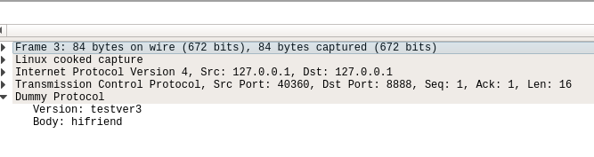

### Writing a Wireshark dissector in Rust

#### What this repo contains

* Basic TCP [server](./server) written in Rust, listening on port 8888 for a made-up binary protocol called dummy
* Basic TCP [client](./client) which sends dummy protocol messages to the server on port 8888
* Wireshark [dissector](./dissector) which, when compiled, allows Wireshark to understand the dummy protocol

#### The dummy protocol

16-byte payload - first 8 bytes is an 8-char string representing the "version", the second 8 bytes is an 8-char string representing the "body".

The catch is that these are encoded (with [transform](./transform)). The encode/decode is just add/subtract 1 from the chars. Yep, not safe, overflow, underflow - it's just for demonstration.

We "encode" (i.e. increment each char) the data before sending it on the wire in [client/src/main.rs](./client/src/main.rs):

```rust
let version = encode(&CString::new("testver3").unwrap().into_bytes());
let body = encode(&CString::new("hifriend").unwrap().into_bytes());
```

I use CStrings here to use [into_bytes](https://doc.rust-lang.org/std/ffi/struct.CString.html#method.into_bytes) to drop the implicit NUL termination of Rust.

```rust
let mut payload = [&version[..], &body[..]].concat();

let nsent = unsafe { send(fd, payload.as_mut_ptr() as *mut c_void, MSGLEN, 0) };

if nsent < 0 {
    bail!("recv failed: {}", Errno::last());
} else {
    println!("Sent: {} bytes...\n", nsent);
}
```

These are [decoded server-side](./server/src/main.rs):

```rust
let vers = decode(&payload[..8]);
let body = decode(&payload[8..16]);

println!(
    "\tversion: {:?}\n\tbody: {:?}",
    String::from_utf8_lossy(&vers),
    String::from_utf8_lossy(&body)
);
```

#### tcpdump - why can't I understand it?

From the client we saw that we're sending a Dummy packet with:

```json
version: "testver3"
body: "hifriend'
```

However, since it's encoded in this protocol, you can't understand the plain-text from tcpdump.

Client:

```
sevagh:wireshark-dissector-rs $ ./target/debug/client
Sent: 16 bytes...

sevagh:wireshark-dissector-rs $
```

Server:

```
sevagh:wireshark-dissector-rs $ ./target/debug/server
Read 16 bytes...

        version: "testver3"
        body: "hifriend"
```

Sometimes in prod we want to check the packets with tcpdump - debugging in case the server isn't receiving, or any other reason:

```
sevagh:wireshark-dissector-rs $ sudo tcpdump -i any dst port 8888 -A
tcpdump: verbose output suppressed, use -v or -vv for full protocol decode
listening on any, link-type LINUX_SLL (Linux cooked), capture size 262144 bytes
11:04:38.803566 IP localhost.41104 > localhost.ddi-tcp-1: Flags [P.], seq 0:16, ack 1, win 342, options [nop,nop,TS val 2431784080 ecr 2431784080], length 16
E..D..@.@............."..Y.........V.8.....
........uftuwfs4ijgsjfoe
```

Here we see the body: `uftuwfs4 ijgsjfoe`. This is `testver3 hifriend` with all the chars incremented, but pretend that this is a more complicated protocol with more fields and more rigorous encoding.

#### Rust FFI in the Wireshark dissector

I'll skip the repetition and give a link-dump of some posts I perused to understand how to write a Wireshark dissector in C:

* http://www.protomatics.com/wireshark_dissector.html (without the weird TSN thingy)
* https://www.wireshark.org/docs/wsdg_html_chunked/ChDissectAdd.html
* https://www.wireshark.org/docs/wsar_html/epan/
* https://github.com/alexcrichton/rust-ffi-examples/tree/master/c-to-rust

All of this code can be found in [./dissector/plugins](./dissector/plugins).

Importantly, these are the additions I made for Rust FFI inside the dissector.

In [`dummy/Makefile.rust`](./dissector/plugins/dummy/Makefile.rust), the rule to create `libdummy_dissector.a`:

```
libdummy_dissector:
        @cargo build
        @cp ../../../target/debug/libdummy_dissector.a ./
```

This places the compiled Rust/FFI `.a` file into the `dummy` plugin directory.

[`dummy/Cargo.toml`](./dissector/plugins/dummy/Cargo.toml):

```
[lib]
name = "dummy_dissector"
crate-type = ["staticlib"]

[dependencies]
transform = { path = "../../../transform" }
common = { path = "../../../common" }
libc = "0.2.29"
```

The function signature inside [`dummy/src/lib.rs`](./dissector/plugins/dummy/src/lib.rs):

```rust
#![crate_type = "staticlib"]

#[no_mangle]
pub extern "C" fn dissect_dummy_rs(data: &mut [u8]) -> i32 {
```

In [`dummy/Makefile.am`](./dissector/plugins/dummy/Makefile.am):

```
dummy_la_LDFLAGS = $(PLUGIN_LDFLAGS) libdummy_dissector.a
```

In [`dummy/packet-dummy.c`](./dissector/plugins/dummy/packet-dummy.c):

```c
extern int32_t
dissect_dummy_rs(const void *data);
```

After this, copying the dummy plugin folder to your Wireshark sources ([more here](./dissector/README.md)) should allow you to compile Wireshark with the FFI. There's a [Make rule](./Makefile):

```
wireshark_plugin:
        @if test -z "$$WIRESHARK_SRC_DIR"; then echo "Please define WIRESHARK_SRC_DIR" && exit -1; fi;
        @cd $(WIRESHARK_PLUGIN_DIR)/dummy && make -f ./Makefile.rust
        @cp -r $(WIRESHARK_PLUGIN_DIR) $$WIRESHARK_SRC_DIR
        @cd $$WIRESHARK_SRC_DIR && ./autogen.sh && make -C plugins && make && sudo make install && cd -
```

#### The result

When you launch Wireshark with [`dummy.pcap`](./dissector/dummy.pcap) file, you're greeted with a parsed protocol:



We taught Wireshark how to understand dummy!

#### How?

In the body of the dissector method in [`packet-dummy.c`](./dissector/plugins/dummy/packet-dummy.c), we delegate decoding the packet to Rust:

```c
static int
dissect_dummy(tvbuff_t *tvb, packet_info *pinfo, proto_tree *tree, void *data)
{
        // this is our rust function!
        // it modifies the packet in place to decode it
        dissect_dummy_rs(tvb->real_data);

        gint offset = 0;

        // here we print the decoded data (once rust is done decoding it)
        if (tree) {
                proto_item *ti;
                ti = proto_tree_add_item(tree, proto_dummy, tvb, 0, -1, FALSE);
                tree = proto_item_add_subtree(ti, ett_dummy);
                proto_tree_add_item(tree, hf_dummy_version, tvb, offset, 8, FT_STRING);
                offset += 8;
                proto_tree_add_item(tree, hf_dummy_body, tvb, offset, 8, FT_STRING);
        }
```

The Rust code looks like this:

```
use transform::decode;

pub extern "C" fn dissect_dummy_rs(data: &mut [u8]) -> i32 {
    if data.len() > 2*MSGLEN {
        return -1;
    }

    let mut decoded_version = decode(&data[..8]);
    let mut decoded_body = decode(&data[8..]);

    // some unsafe memcpies 
}
```

The beauty of this is that we used the *same* [transform](./transform) crate that the client and server use.

What does this imply? You can re-use protocol decoding logic from your Rust application code inside the Wireshark dissector instead of needing to rewrite it in C or Lua.
